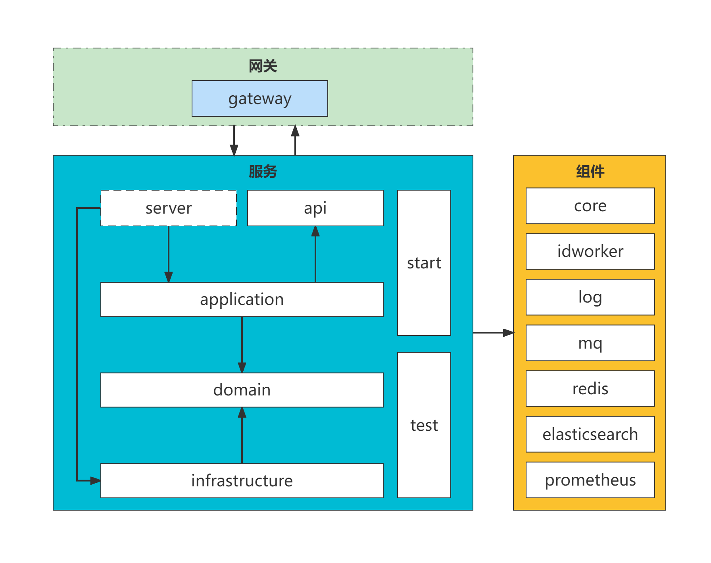

# Monet
**Monet**

## 项目结构


## 服务结构

- ```api```: 接口层, 提供内部 RPC 接口/对象定义
- ```server```: 服务层, 处理 网页端/移动端/H5/HTTP等 WEB请求, WEB 接口/对象定义, 仅提供内部服务则不需要此层; 依赖 ```application``` 层
- ```application```: 应用层, 处理 api/server 请求, 接口调度/数据聚合/消息消费/定时任务等; 依赖 ```api domain``` 层
- ```domain```: 领域层, 领域实现, 处理业务核心逻辑
- ```infrastructure```: 基础设施层, 数据库映射/服务外接口映射, 仅做数据设施/接口设施转换 不处理业务逻辑; 依赖 ```domain``` 层
- ```test```: 单元测试 其它层不做测试逻辑; 依赖 ```server/application infrastructure``` 层
- ```start```: 仅提供服务启动类 服务配置文件; 依赖 ```server/application infrastructure``` 层


## draw-archetypes
- **项目原型**
- ```draw-service```: 创建纯后端 ```Dubbo``` 应用
  ```
  mvn archetype:generate  \
    -DgroupId=com.fakebilly.monet \
    -DartifactId=basic-service \
    -Dversion=1.0.0 \
    -Dpackage=com.fakebilly.monet.business \
    -DarchetypeArtifactId=draw-service \
    -DarchetypeGroupId=com.fakebilly.monet \
    -DarchetypeVersion=1.0.0
  ```
- ```draw-web```: 创建 ```WEB``` 应用
  ```
  mvn archetype:generate  \
    -DgroupId=com.fakebilly.monet \
    -DartifactId=basic-service \
    -Dversion=1.0.0 \
    -Dpackage=com.fakebilly.monet.business \
    -DarchetypeArtifactId=draw-web \
    -DarchetypeGroupId=com.fakebilly.monet \
    -DarchetypeVersion=1.0.0
  ```

## monet-core
- **核心类**
- 定义顶层对象/属性

## monet-idworder
- **ID 发号器**
- 生成雪花 ID

## monet-mq
- **RocketMQ 客户端**
    - ```rocketmq-client version``` 4.9.4
- 定制开发 ```RocketMQ Client```

## monet-redis
- **Redis 客户端 Redisson**
  - ```redisson version``` 3.15.6
- 定制开发 ```Redisson```

## monet-es
- **Elasticsearch 客户端**
  - ```elasticsearch version``` 7.16.3
- 定制开发 ```Elasticsearch Java Client```

## monet-prometheus
- **Prometheus Metric 采集**
- 定制开发 ```Prometheus``` 指标
  - ```micrometer version``` 1.5.9
- 自定义指标采集
- 扩展 ```Tomcat``` 指标
- 新增 ```Undertow``` 指标
- 新增 ```Dubbo``` 指标
- 扩展 ```HTTP``` 指标
- 适配 ```Prometheus.yaml``` 自动发现: ```文件```

## monet-log
- **log 链路/日志扩展**
- 基于 ```SkyWalking``` 插桩 自定义插件 ```monet-log-plugin```
  - ```skywalking version``` 8.9.0
- 适配 ```Logback``` 链路
- 适配 ```Log4j2``` 链路
- 适配 ```ThreadPoolExecutor.execute``` Lambda 表达式
- 适配 ```ThreadPoolExecutor.submit``` Lambda 表达式
- ```skywalking-agent``` agent 编译包
> https://github.com/fakebilly-dev/skywalking

## basic-service
- **示例服务: 基础服务**
- 启动时添加命令
  - 
  ``` 
  -ea -Dmonet.nacos.config.server.addr=[YOUR_NACOS_SERVER_ADDR]  -Dmonet.nacos.config.namespace=[YOUR_NACOS_NAMESPACE] -javaagent:[YOUR_SKYWALKING_JAVA_AGENT_ABSOLUTE_PATH] -Dskywalking.agent.service_name=[YOUR_APPLICATION_NAME] -Dskywalking.collector.backend_service=[YOUR_SKYWALKING_BACKEND_HOST_PORT] -Dskywalking.plugin.jdkthreading.threading_class_prefixes=[YOUR_APPLICATION_ROOT_PACKAGE]
  # eg
  -ea -Dmonet.nacos.config.server.addr=http://127.0.0.1:8848  -Dmonet.nacos.config.namespace=4edf5456-t6h2-352v-dfre-5ga31rt431e4 -javaagent:/usr/local/skywalking/skywalking-agent/skywalking-agent.jar -Dskywalking.agent.service_name=basic-service -Dskywalking.collector.backend_service=127.0.0.1:11800 -Dskywalking.plugin.jdkthreading.threading_class_prefixes=com.fakebilly
  ```

## business-service
- **示例服务: 业务服务**
- 启动时添加命令
  - 
  ``` 
  -ea -Dmonet.nacos.config.server.addr=[YOUR_NACOS_SERVER_ADDR]  -Dmonet.nacos.config.namespace=[YOUR_NACOS_NAMESPACE] -javaagent:[YOUR_SKYWALKING_JAVA_AGENT_ABSOLUTE_PATH] -Dskywalking.agent.service_name=[YOUR_APPLICATION_NAME] -Dskywalking.collector.backend_service=[YOUR_SKYWALKING_BACKEND_HOST_PORT] -Dskywalking.plugin.jdkthreading.threading_class_prefixes=[YOUR_APPLICATION_ROOT_PACKAGE]
  # eg
  -ea -Dmonet.nacos.config.server.addr=http://127.0.0.1:8848  -Dmonet.nacos.config.namespace=4edf5456-t6h2-352v-dfre-5ga31rt431e4 -javaagent:/usr/local/skywalking/skywalking-agent/skywalking-agent.jar -Dskywalking.agent.service_name=business-service -Dskywalking.collector.backend_service=127.0.0.1:11800 -Dskywalking.plugin.jdkthreading.threading_class_prefixes=com.fakebilly
  ```
